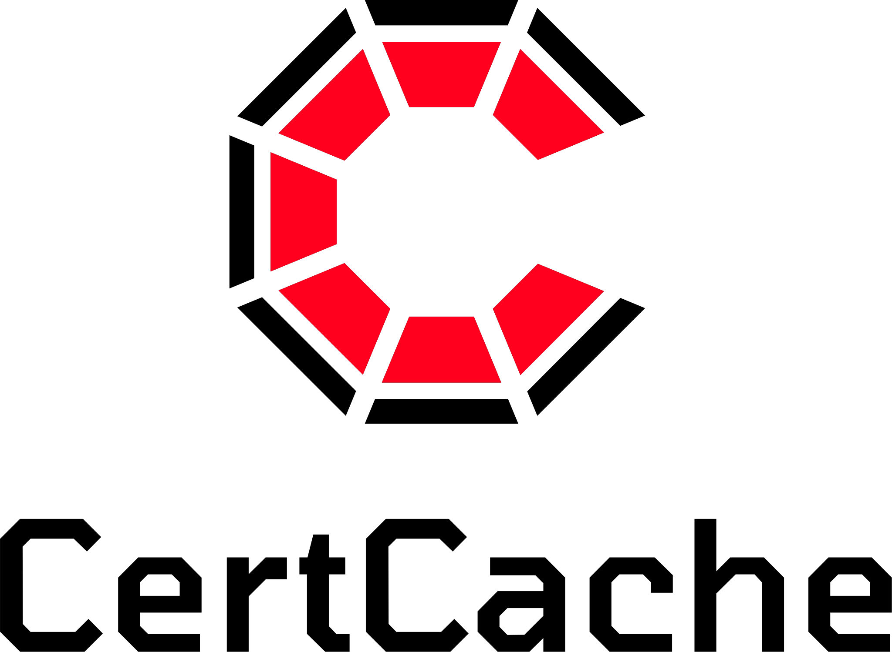

<div align="right">
  
</div>
<div align="center">
  
</div>


# CertCache

## What is CertCache?

CertCache is a secure TLS/SSL certificate distribution service. It can do the following things:

* Securely share TLS certificates between a number of clients
* Generate certificates dynamically using Let's Encrypt
* Avoid Let's Encrypt usage limits by serving certificates from a cache
* Share manually downloaded TLS certificates from third parties such as Comodo
* Declaratively define ceritificates within config - either in a JSON config file or in `docker-compose.yml` if using Docker

## Overview

CertCache is normally run in a server and client configuration. Clients request certificates from the server. If a matching certificate is found in the server cache it is served. If no certificate is found it can be generated dynamically using Let's Encrypt.

If however you do not need the cache functionality you can use CertCache in [standalone mode](docs/Standalone%20mode.md) to gain access to all the benefits excluding the caching functionality.

## Usage

### Client and server instances

Clients and servers run in Docker containers. The server supplies certificates to clients on demand. The clients then share the certificates with containers that require access to them.

#### Configure CertCache server

Choose a domain from which to run CertCache server. It does not need to be one of the domains you intend to create a certificate for. But it needs to be static and will be the domain that clients connect to in order to obtain certificates.

If your company domain is `93million.org`, a good name would be `certcache.93million.org`. This domain will be refered to as `<certcache-server>` in the documentation from now on. We will also refer to `<cert-domain>` - this is a domain name that you want to generate an SSL/TLS cert for. Replace these references with your own values each time they appear in the documentation.

Instantiate a server to host CertCache server and install Docker and Docker Compose.

> ⚠️ Warning: CertCache server and clients will contain TLS/SSL keys. They should not be used on shared servers and insecure environments that other people have access to.

##### CertCache server DNS

Create 2 DNS records:

  * Create a `A` record to point `<certcache-server>` to your server instance
  * Create an `NS` record `acme.<certcache-server>` which points to `<certcache-server>`

Eg. if `<certcache-server>` is `certcache.93million.org` then create an `NS` record `acme.certcache.93million.org` which points to `certcache.93million.org`

##### CertCache server Docker container

On your CertCache server instance, perform the following steps:

  * Create a directory with a file named `docker-compose.yml` with these contents:

```yaml
version: '3.7'
services:
  certcacheserver:
    container_name: certcacheserver
    image: ghcr.io/93million/certcache
    restart: unless-stopped
    ports:
      - '53:53/udp'
      - '53:53/tcp'
      - '80:80/tcp'
      - '4433:4433/tcp'
    volumes:
      - ./catkeys/:/certcache/catkeys/:rw
      - ./cache/:/certcache/cache/:rw
    environment:
      CERTCACHE_CERTBOT_EMAIL: <your@certbot-email.address>
    command: ['serve']
```

  * Change `CERTCACHE_CERTBOT_EMAIL` to the email address you provide to `certbot` 'for important account notifications'
  * Run `docker-compose run --rm certcacheserver create-keys`
  * Run `docker-compose up -d`

See [docs/Installing certcache server.md](docs/Installing%20certcache%20server.md) for more info

#### Configure CertCache client

On your CertCache client instances, perform the following steps:

  * Create a directory with a file named `docker-compose.yml` with these contents:

```yaml
version: '3.7'
services:
  certcache:
    container_name: certcache
    image: ghcr.io/93million/certcache
    restart: 'unless-stopped'
    volumes:
      - ./certcache/catkeys/:/certcache/catkeys/:rw
      - ./certcache/certs/:/certcache/certs/:rw
    environment:
      CERTCACHE_UPSTREAM: <certcache-server>
      CERTCACHE_CERTS: |
        - certName: <cert-name>
          domains:
            - '<cert-domain-1>'
            - '*.<cert-domain-1>'
            - '<cert-domain-2>'
            - '*.<cert-domain-2>'
          testCert: true
```

  * Change env var `CERTCACHE_UPSTREAM` to contain the domain of your CertCache server
  * Change env var `CERTCACHE_CERTS` to list the certificates you want to synchronise with the server. `<cert-domain-n>` represents a domain you want to generate a cert for. `<cert-name>` represents the name of the certificate directory into which the certificate and key will be written.
  * Make a directory at `./certcache/catkeys/` and copy into it the file `client.catkey` from the `catkeys` directory on the server

Do not start the client yet. We need to configure challenges first.

> ⚠️ the `testCert: true` specified in `CERTCACHE_CERTS` causes CertBot to generate testing certificates. This is useful when testing a setup. Remove `testCert` or set to `false` when you are ready to use valid certs.

See [docs/Installing certcache client.md](docs/Installing%20certcache%20client.md) for more info

### Configure challenges

Configure domains for either HTTP-01 or DNS-01 acme validation (you don't need to configure both). DNS-01 is easier in most cases and allows for wildcard domains.

#### DNS-01

For each domain you want to generate a cert:

  * create a `CNAME` record `_acme-challenge.<cert-domain>` that points to `<cert-domain>.acme.<certcache-server>`

Eg. if `<cert-domain>` is `93m.co` and `<certcache-server>` is `certcache.93million.org`, then add a CNAME record for the host `_acme-challenge.93m.co` that points to `93m.co.acme.certcache.93million.org`

> 💡It's a good idea to use low TTLs when creating these records. A value of `300` seconds means you will have to wait no more than 5 minutes for any changes to take affect.

#### HTTP-01

For each domain you want to generate a cert:

  * set up HTTP redirection from `http://<cert-domain>/.well-known/acme-challenge` to `http://<certcache-server>/.well-known/acme-challenge`

See [docs/Configure challenges.md](docs/Configure%20challenges.md) for more info

### Using the certificates

Now the challenges are configured you can start CertCache client. On the CertCache client instance, run:

```
docker-compose up -d
```

Certificates will be placed in `./certcache/certs`. Map a read-only volume to this path in containers that require access to the certificates.

See [docs/Using certificates.md](docs/Using%20certificates.md) for more info

## Advanced configuration

As shown, CertCache is configured through environment variables. It can also be configured through a JSON config file if you don't want to place config in `docker-compose.yml`.

For a list of environment variables and config directives, please see [docs/Config directives.md](docs/Config%20directives.md).

## ECDSA Certificates

CertCache supports generating and caching of ECDSA certificates. See [docs/ECDSA Certificates.md](docs/ECDSA%20Certificates.md) for more info.

## Debugging problems

See [docs/Debugging problems.md](docs/Debugging%20problems.md) for some tips on debugging problems. If you discover bugs please raise an issue in GitHub.

## Alternatives

[cert-manager](https://cert-manager.io/) is a full featured solution for Kubernetes.

## Tests

> ⚠️ Integration tests requires `openssl` (which most platforms already have) and [ngrok](https://ngrok.com/) to be installed.

Run unit tests:

```
npm run test:unit
```

Run integration tests:

```
CERTCACHE_CERTBOT_EMAIL=<your@certbot-email.address> npm run test:sit
```

Run all tests:

```
CERTCACHE_CERTBOT_EMAIL=<your@certbot-email.address> npm test
```

> ℹ️ `CERTCACHE_CERTBOT_EMAIL` is passed to certbot when getting certificates

## License and copyright

All logos, images and artwork are copyright 93 Million Ltd. and used by permission for this project only.

Code is released under the [MIT](LICENSE) license


*Copyright 93 Million Ltd. All rights reserved*

<div align="center"></div>

