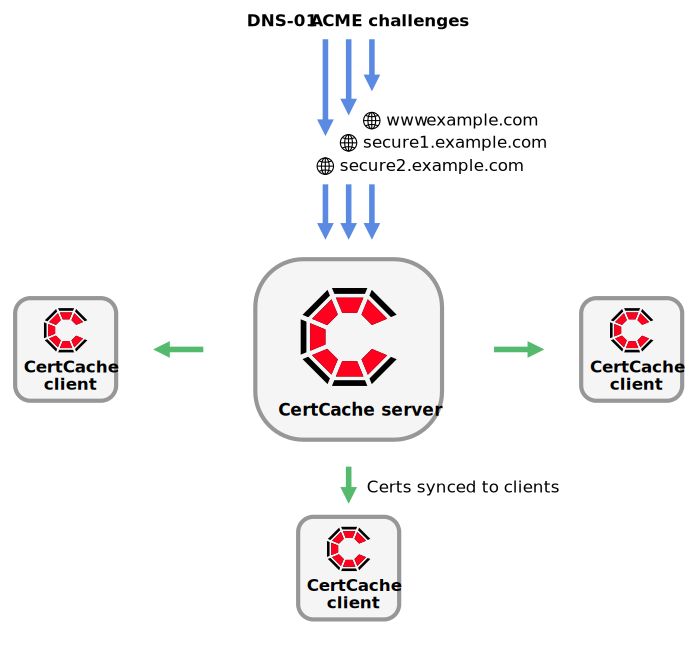
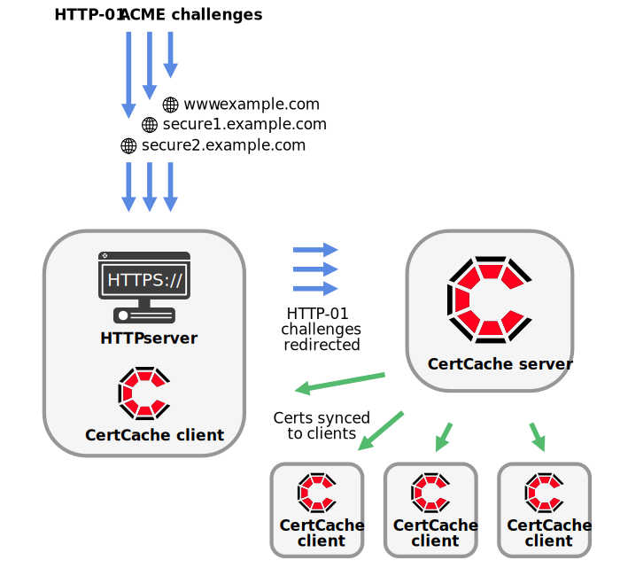

## Configure challenges

If you want to generate certificates using Let's Encrypt you will need to set up either HTTP or DNS for validation.

### DNS challenges

DNS challenges are easy to set up and allow for certificates with wildcard domain - eg. *.93million.org

DNS challenges are in some ways more flexable than HTTP challenges in that they do not require an HTTP server to redirect challenges to CertCache server.

<div align="center"></div>

From your DNS management control panel, perfrom the following steps:
  * Edit the DNS zone for the domain you want to validate
  * For each domain you want to validate, add a `CNAME` record for the host `_acme-challenge.<cert-domain>` that points to `<cert-domain>.acme.<certcache-server>`

To give an example validating the domains `93m.co` and `test.93m.co`, running CertCache server at `certcache.93million.org`
  * Edit the DNS zone for `93m.co`
  * Add a CNAME record for the host `_acme-challenge.93m.co` that points to `93m.co.acme.certcache.93million.org`
  * Add a CNAME record for the host `_acme-challenge.test.93m.co` that points to `test.93m.co.acme.certcache.93million.org`

This will allow you to generate certificate for the domains `93m.co` and `test.93m.co`, including wildcard certificates (eg. `*.93m.co` and `*.test.93m.co`)

> ⚠️ Warning: it's important to recognise that by adding CNAME records for `_acme-challenge` hosts, we are giving `certcache.93million.org` the ability to generate TLS/SSL certificates for these domains. Be very cautious when creating and updating `_acme-challenge` records.

#### What about DNS API credentials?

Certbot users who use DNS-01 valiadtion will be familiar with DNS plugins that require API credentials. CertCache uses [certbot-dns-standalone](https://github.com/siilike/certbot-dns-standalone) which doesn't require DNS API credentials. This has benefits and drawbacks.

The benefits:

  * simple - just create a CNAME record to vaildate a domain. No API or Certbot plugins required
  * unified method of validation that works with every DNS provider
  * domain owners can delegate ability to CertCache users to generate certificates without giving away DNS API credentials

The drawbacks:

  * you have to create a CNAME entry for each domain you want to create certificates for. This is something that is done automatically by a Certbot plugin. One solution to this problem could be to generate a wildcards certificate (eg. `*.example.com`) which can be used with unlimited subdomains. Another solution could be to redirect HTTP-01 challenges from a catch all server (see [below](#http-challenges)) however please note that certificates generated by HTTP-01 challenege cannot contain wildcard domains.

Hopefully for most people, this will be easier than finding a DNS provider with a supported Certbot plugin and configring DNS API credentials. If there is demand, we will support DNS plugins to validate domains using DNS API credentials. Shout out!

#### ❓How to test

You can test using `dig` on the command line. Running `dig _acme-challenge.<cert-domain> CNAME +short` should output `<cert-domain>.acme.<certcache-server>.`. Eg:

```
$ dig _acme-challenge.test.93m.co CNAME +short
test.93m.co.acme.certcache.93million.org.
```

### HTTP challenges

For HTTP validation you will need to be running an HTTP server on the domains you want to validate. A redirection rule needs to be set up for each domain to perform HTTP validation.

<div align="center"></div>

The following example shows how to configure NginX to validate the domains `93m.co` and `secure.93m.co`, running certcache on `certcache.93million.org`

Edit your NginX config and add a redirection rule for the location `/.well-known/acme-challenge`:

```
server {
  listen 80 default;
  listen [::]:80;

  server_name 93m.co secure.93m.co;

  location /.well-known/acme-challenge {
    return 301 http://certcache.93million.org$request_uri;
  }
}
```

This will redirect requests from `http://93m.co/.well-known/acme-challenge/<path>` to `http://certcache.93million.org/.well-known/acme-challenge/<path>`.

Note you can use wildcards and regular expressions in NginX's `server_name` to reduce configuration duplication, however HTTP validation is not capable of creating certificates with wildcard domains.

If you are using Apache, you can redirect requests using `mod_rewrite`'s `Redirect` directive.

#### ❓How to test

You can test using `curl` on the command line. Running `curl -v http://<cert-domain>/.well-known/acme-challenge/foo` should output a `Location:` header showing redirection. Eg:

```
$ curl -v http://93m.co/.well-known/acme-challenge/foo
* Connected to 93m.co (139.162.213.98) port 80 (#0)
> GET /.well-known/acme-challenge/foo HTTP/1.1
…
< Location: http://certcache.93million.org/.well-known/acme-challenge/foo
…
```

### Not running an HTTP server?

If you want to use HTTP-01 validation but not have HTTP servers running on your domains, you can use the inbuilt HTTP server in CertCache to handle validation. See section [Running an HTTP redirect server](./Installing%20certcache%20client.md#running-an-http-redirect-server).
